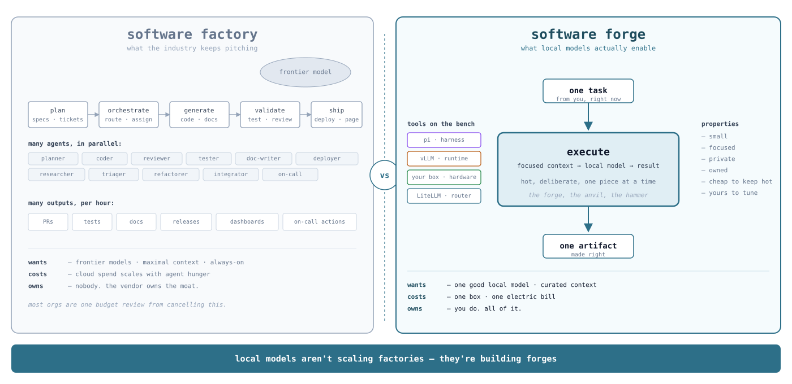

<!-- .slide: class="title" -->

# LMStack

## A development stack for local LLMs

Devashish Meena · AI Tinkerers Seattle · Aug 4, 2026

Note:
5 minutes. Slide 2 defines the term. Slide 3 sells it. Slide 5 is the anchor. Slide 7 is the demo.

---

<!-- .slide: class="definition" -->

## software forge

An AI execution environment powered by a <strong>local LLM</strong>, optimized for a <strong>specific task type</strong>.

  runs 100% airgapped
  does one job well
  uses local inference

smaller than a factory. hotter. yours.

Note:
This is the term I want the room to remember.
Say it slowly. Pause after the punchline. Then pivot to the contrast on the next slide.

---

<!-- .slide: class="diagram" -->

## Software factory vs. software forge

Note:
The reframe. Say the tagline out loud, verbatim:
"Local models aren't scaling factories — they're building forges."
Then pause. Let it land before moving to the stacks.

---

<!-- .slide: class="diagram" -->

## Dev stack with cloud models

Note:
Deliberately underwhelming. Contrast with the next slide.

---

<!-- .slide: class="diagram" -->

## Dev stack with local models

Note:
This slide IS the technical talk. Don't rush.
Call out: pi's curated context, the LiteLLM router, the two config sidebars, and hardware being switchable.
Let the density of the diagram carry the argument — you don't need to name every box.

---

## Why bother?

- **Constraints force creative solutions** — you can't just throw a bigger model at it
- **Cost is becoming a problem** — token bills scale with agent usage, and agents are getting hungrier
- **Learning local unlocks new possibilities** — on-device agents, air-gapped work, fine-tuning loops the cloud won't let you run

Note:
45 seconds. One sentence per bullet, then move on.

---

## Demo

> Real task, real hardware, no cloud.

Note:
Screen recording preferred over live.
Show the agent hitting the local endpoint with observability visible so it's obvious this is local.
Have a backup screenshot in case A/V fails.

---

<!-- .slide: class="closer" -->

# github.com/ric03uec/lmstack

Apache-2.0 · contributions welcome · @ric03uec

