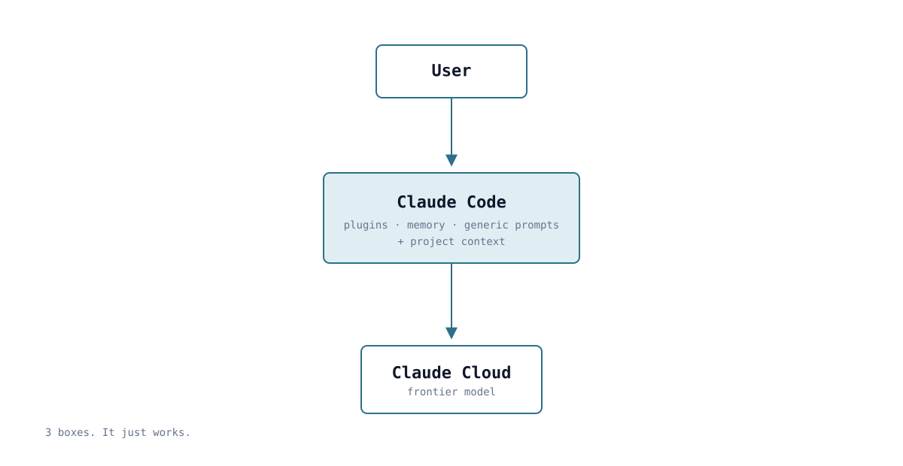
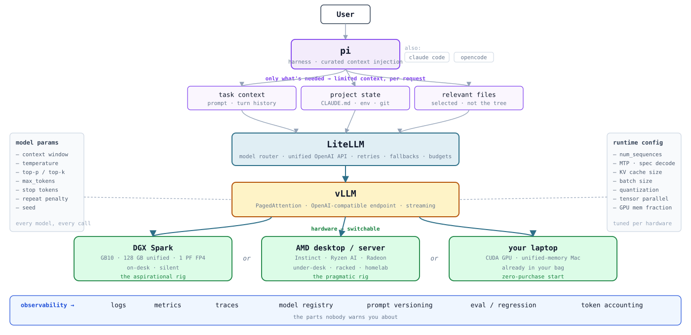
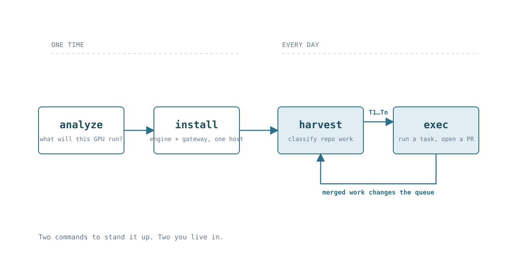
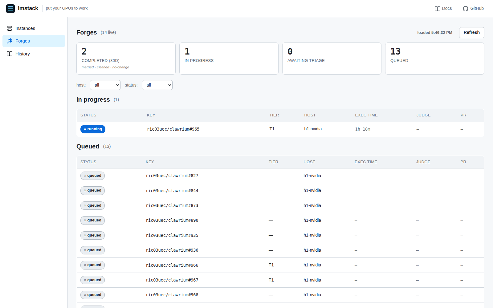
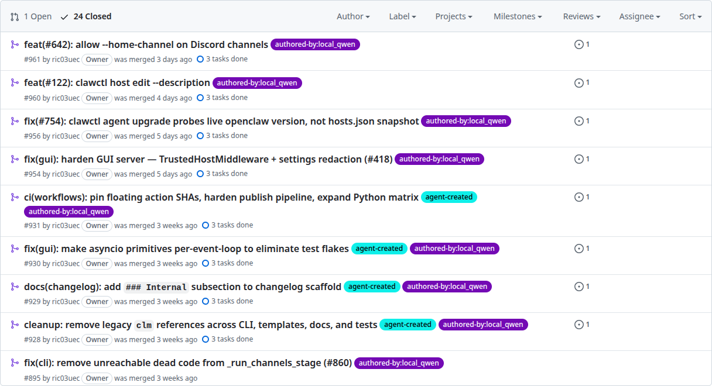

<!-- .slide: class="title" -->

# lmstack

## Put your local GPU to work.

AI Tinkerers Seattle · @ric03uec

Note:
5 minutes. Arc is problem → solution. Two problems, two solutions, one workflow, three demos, done.
Do not linger on any slide before the demos.

---

<!-- .slide: class="versus" -->

## Developing with local models is hard

  

    <h3>with a cloud model</h3>
    
  

  

    <h3>with local models</h3>
    
  

Note:
Click once: three boxes. Nobody thinks about this — it is the baseline expectation people arrive with.
Click again: don't read the boxes out. The density IS the argument.
Say: "and every one of these is a place to get it wrong."

---

<!-- .slide: class="problem" -->

## Two fundamental problems

  

    <h3>1 · Infrastructure</h3>
    
Engine, gateway, quantisation, VRAM budget, routing, observability.

    
You are the platform team now.

  

  

    <h3>2 · Work management</h3>
    
Even once it runs — what do you actually give it?

    
A 27B model is not a smaller Sonnet. It will not decompose the problem for you.

  

Local inference is cheap. Deciding what to run is the cost.

Note:
This is the whole talk in one slide. Everything after this is these two problems and what lmstack does about them.
Problem 2 is the one people underestimate: the gap is reasoning, not context — Qwen runs at 200 K here too.

---

<!-- .slide: class="solution" -->

## Solution 1 — lmstack builds the infra for you

Ansible, per host. The stack becomes a config file you can review.

<ul>
  <li>Inference engine bound to <code>127.0.0.1</code> — the gateway is the only open port</li>
  <li>LiteLLM in front, so aliases stay the same across NVIDIA and AMD</li>
  <li>Model YAML is the contract: ports, quantisation, VRAM budget, all validated</li>
  <li>Fits in <strong>8 GB VRAM</strong> by default</li>
</ul>

Note:
The point is not "I wrote some Ansible." The point is the stack is now reviewable, not a weekend.

---

<!-- .slide: class="solution" -->

## Solution 2 — lmstack manages the work queue

A <strong>task classifier</strong> decides what this model can actually hold.

  repo
  →
  candidate tasks
  →
  classify
  →
  local · or not

<ul>
  <li>Scores each task against the installed model, not against a benchmark</li>
  <li>Rejects loudly instead of failing halfway through</li>
  <li>Output is a queue you can read: <code>T1</code>, <code>T2</code>, <code>T3</code>…</li>
</ul>

Note:
Emphasise "rejects loudly". A classifier that only says yes is a random number generator.

---

<!-- .slide: class="diagram" -->

## The whole workflow — four commands

 <!-- .element: class="stack-svg" -->

Note:
analyze and install are one-time per host. harvest and exec are the loop you live in.
Merged work changes the repo, which changes the queue — that's why it's a loop, not a pipeline.

---

<!-- .slide: class="demo" -->

## Demo — `harvest`

Note:
PLACEHOLDER RECORDING. Full procedure: RECORDING.md in this directory, section 3.
Beat: /lmstack:harvest ric03uec/clawrium reads ten open issues, classifies each against
the installed model, writes one JSON record per task under ~/.lmstack/<role>/tasks/.
Three land in T1. One is rejected — say why out loud: nothing named, nothing bounded.
Then read the queue back off disk with lmstack-task list. The report is model output;
the queue is the artefact.

---

<!-- .slide: class="demo" -->

## Demo — `exec`

Note:
PLACEHOLDER RECORDING. Full procedure: RECORDING.md in this directory, section 4.
Beat: /lmstack:exec ric03uec__clawrium#NN takes a git worktree, then opens ONE tmux
session with TWO windows — lm-exec runs the local model via pi, lm-judge runs a
separate reviewing agent. Ctrl+a w to flip between them on camera.
They share one worktree, so they never run at the same time.
The exec agent is forbidden from touching gh at all; the JUDGE opens the PR —
the model that wrote the code is the wrong one to certify it.
Say out loud that the merge is still a human decision. Stop at the PR url.

---

<!-- .slide: class="proof single" -->

## Demo — Dashboard

Local dashboard — queue, runs, verdicts · <code>127.0.0.1:7878</code>, read-only

Note:
Real screenshot of the Forges page at 127.0.0.1:7878/#/forges — 14 live forges,
one running, thirteen queued, all on h1-nvidia.
Start it with `lmstack-ui start`; it serves 127.0.0.1:7878 and is read-only — it
renders ~/.lmstack/ and mutates nothing.
Walk it in one pass: the queue, then a run, then a verdict. That is the whole loop,
on disk, with no cloud call anywhere in it.

---

<!-- .slide: class="proof single" -->

## A real example: Clawrium

<a href="https://github.com/ric03uec/clawrium">github.com/ric03uec/clawrium</a>

24 closed · 22 merged · <code>label:authored-by:local_qwen</code>

Note:
REAL SCREENSHOT, not a placeholder. Filtered on the authored-by:local_qwen label.
Every row here was written by a local model on this stack, reviewed by the judge,
and merged by a human.
Point at the two that were closed rather than merged — #883 and #879. Those are the
failures that produced the rule that the judge, not the author, opens the PR.
The repo is public — say the URL out loud, they can check it afterwards.

---

<!-- .slide: class="closer" -->

# lmstack = infra + task classifier

Everything else is your GPU, already paid for.

#OwnYourInference

github.com/ric03uec/lmstack · Apache-2.0 · @ric03uec

Note:
Close on: "the hardware is sitting there. This is the part that was missing." Then thanks.
